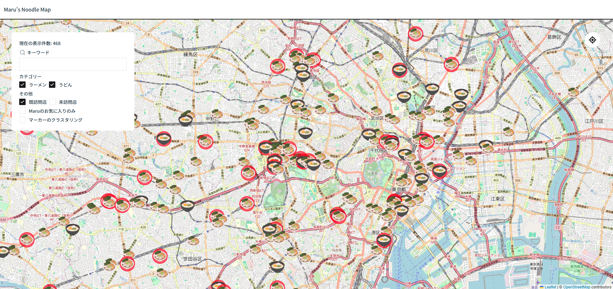

# 🍜NoodleMap

noodle-map is a personal project designed to catalog and map ramen and udon shops I've visited or am interested in. It
serves both as a tool for my own reference and management, as well as a way to share information with my friends.

You can access the live version here: https://noodle-map.marulab.jp/

