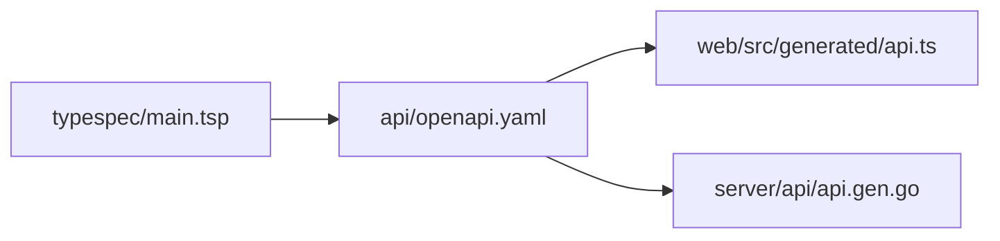

# NoodleMap

NoodleMap is my personal map for ramen, udon, and other noodle shops I have eaten at or want to keep track of. The repository is public, but it is primarily maintained as a personal project and operations notebook rather than a contributor-facing open source project.

Live app: https://noodle-map.marulabs.dev/


## Stack

- Frontend: React, TypeScript, React Router, Vite, Chakra UI, MapLibre GL, Google Maps APIs
- Backend: Go, Gin, SQLite
- API contract: TypeSpec -> OpenAPI -> generated frontend/backend API types
- Local orchestration: Docker Compose
- Deployment: Render Blueprint in `render.yaml`
- Infrastructure: Terraform for Cloudflare/R2-related resources
- Tooling: `mise` is introduced and will be expanded as the main tool version manager

## Repository Layout

- `web/`: frontend app
- `server/`: Go API server
- `db/`: SQLite schema, initialization scripts, queries, and seed data
- `typespec/`: TypeSpec API contract source
- `api/openapi.yaml`: generated OpenAPI output
- `terraform/`: Terraform configuration
- `docs/`: supporting notes and documentation

Generated files are committed for reviewability:

- `api/openapi.yaml`
- `web/src/generated/api.ts`
- `server/api/api.gen.go`

Do not edit generated files directly. Update `typespec/main.tsp` first, then regenerate.

## Common Commands

Frontend:

```sh
cd web
npm run dev
npm run build
npm run lint
npm run format
```

Backend:

```sh
cd server
go run .
go test ./...
go fmt ./...
```

API generation from the repository root:

```sh
npm run api:generate
npm run api:check
```

Docker Compose from the repository root:

```sh
docker compose up --build
```

The Compose setup starts the API server on `http://localhost:8888` and the frontend on `http://localhost:8080`.

## API Contract Flow


```mermaid
flowchart LR
  tsp["typespec/main.tsp"] --> openapi["api/openapi.yaml"]
  openapi --> webtypes["web/src/generated/api.ts"]
  openapi --> goapi["server/api/api.gen.go"]
```

When changing routes, request/response shapes, or API-facing models:

1. Update `typespec/main.tsp`.
2. Run `npm run api:generate`.
3. Use generated frontend types from `web/src/generated/api.ts`.
4. Keep backend route wiring through the generated `server/api` bindings.

## mise

`mise` is already present via `.mise.toml`.

Current responsibilities:

- Pin Terraform to `1.15.5`.
- Load local environment values from `.env`.
- Set AWS checksum options required by the current R2/S3-compatible tooling.

This setup is intentionally small for now. Node.js, npm, Go, and other developer tools may be moved into `mise` later as the local workflow becomes more standardized.

## Terraform

Terraform lives in `terraform/` and currently manages Cloudflare/R2-related infrastructure, including the basemap R2 module. State is configured with an S3-compatible backend pointing at Cloudflare R2.

Typical commands:

```sh
cd terraform
terraform init
terraform plan
```

Applying changes requires valid Cloudflare/R2 credentials in the environment. `.env.example` lists the currently expected secret variables.

## Deployment Notes

Render service configuration is defined in `render.yaml`.

- Backend: Docker web service with a persistent disk for SQLite data.
- Frontend: Render static site.
- Public domains: `noodle-map.marulab.jp` and `noodle-map.marulabs.dev`.
- API traffic from the frontend is rewritten to the Render backend.

Secrets such as `TOKEN_SECRET`, `AWS_ACCESS_KEY_ID`, `AWS_SECRET_ACCESS_KEY`, and `VITE_GOOGLE_API_KEY` are configured outside the repository.

## Editing Notes

- Japanese UI text is UTF-8. If text looks garbled, reopen the file as UTF-8 before editing.
- Before finishing frontend text changes, run `npm run check:mojibake` from `web/`.
- After editing `CLAUDE.md`, run `npm run sync-agents` from `web/` to update `AGENTS.md`.
